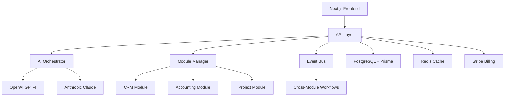

# CoreFlow360 - AI-First Modular ERP Platform

[](https://nextjs.org/)
[](https://www.typescriptlang.org/)
[](https://www.prisma.io/)
[](https://stripe.com/)
[](LICENSE)

> **The world's first AI-powered modular ERP that adapts to your business needs**

CoreFlow360 revolutionizes enterprise software by combining the flexibility of modular architecture with the intelligence of advanced AI. Pay only for what you need, and watch your AI capabilities grow as you add modules.

## 🚀 Key Features

### 🧩 Modular Architecture
- **Choose Your Modules**: CRM, Accounting, Inventory, Projects, HR, and more
- **Smart Bundles**: Save 10-25% with intelligent module combinations
- **Seamless Scaling**: Add or remove modules as your business evolves
- **No Vendor Lock-in**: Keep your data, change your stack

### 🤖 AI-Powered Intelligence
- **Adaptive AI**: Intelligence grows with your module combinations
- **Predictive Analytics**: Customer churn, sales forecasting, inventory optimization
- **Automated Workflows**: Cross-module business process automation
- **Natural Language**: Ask questions, get insights in plain English

### 💰 Competitive Pricing
- **Transparent**: $7-58 per user per module per month
- **Bundle Discounts**: Up to 25% off with Business or Enterprise suites
- **No Hidden Fees**: What you see is what you pay
- **Free Trial**: 30 days, no credit card required

### 🔒 Enterprise Security
- **SOC 2 Compliant**: Rigorous security controls and auditing
- **GDPR Ready**: Full compliance for European customers  
- **Zero Trust**: Every request validated and monitored
- **Data Encryption**: AES-256 encryption at rest and in transit

## 📊 Pricing Tiers

| Module | Individual | Business Bundle | Enterprise Suite |
|--------|------------|----------------|------------------|
| **CRM** | $25/user/month | ✅ Included | ✅ Included |
| **Accounting** | $30/user/month | ✅ Included | ✅ Included |
| **Projects** | $22/user/month | ✅ Included | ✅ Included |
| **Inventory** | $18/user/month | ✅ Included | ✅ Included |
| **HR** | $28/user/month | ❌ | ✅ Included |
| **Analytics** | $40/user/month | ❌ | ✅ Included |
| **AI Insights** | $45/user/month | ❌ | ✅ Included |
| | | | |
| **Total** | Pay per module | **$85/user/month** | **$150/user/month** |
| **Savings** | - | **Save $35/month** | **Save $90/month** |

*Volume discounts available for 10+ users*

## 🏗 Architecture



## 🛠 Tech Stack

- **Framework**: Next.js 15.4.5 with App Router
- **Language**: TypeScript (strict mode)
- **Database**: PostgreSQL with Prisma ORM
- **Authentication**: NextAuth.js v5
- **Payments**: Stripe
- **AI/ML**: OpenAI GPT-4, Anthropic Claude
- **Caching**: Redis
- **Styling**: Tailwind CSS
- **Testing**: Vitest + React Testing Library

## 🚀 Quick Start

### Prerequisites
- Node.js 18.17.0+
- PostgreSQL 14+
- Stripe account
- OpenAI API key

### Installation

```bash
# Clone the repository
git clone https://github.com/your-org/coreflow360.git
cd coreflow360

# Install dependencies
npm install

# Set up environment variables
cp .env.example .env.local
# Edit .env.local with your API keys and database URL

# Set up database
npx prisma migrate dev
npx prisma generate
npm run db:seed:modules

# Start development server
npm run dev
```

Visit `http://localhost:3000` to see CoreFlow360 in action!

## 📖 Documentation

- **[User Guide](USER_GUIDE.md)** - Complete user manual
- **[Developer Guide](DEVELOPER_GUIDE.md)** - Architecture and development
- **[API Documentation](API_DOCUMENTATION.md)** - REST API reference
- **[Deployment Guide](DEPLOYMENT_GUIDE.md)** - Production deployment

## 🎮 Interactive Demo

Experience CoreFlow360's modular architecture:

```bash
npm run dev
# Visit http://localhost:3000/demo/subscription-simulator
```

Features:
- **Module Selection**: See pricing changes in real-time
- **AI Adaptation**: Watch AI capabilities evolve with module combinations
- **Workflow Simulation**: Experience cross-module automation

## 🧪 Testing

```bash
# Run all tests
npm run test

# Run specific test suites
npm run test:subscription    # Subscription management tests
npm run test:ai             # AI orchestration tests
npm run test:ui             # Component tests

# Coverage report
npm run test:coverage
```

## 🔐 Security Features

### Built-in Protection
- **CSRF Protection**: Automatic token validation
- **Rate Limiting**: Configurable per endpoint
- **Input Sanitization**: XSS and injection prevention
- **API Key Authentication**: HMAC-signed keys
- **Tenant Isolation**: Multi-tenant data separation

### Monitoring
- **Health Checks**: `/api/health` endpoint
- **Performance Metrics**: Built-in monitoring
- **Error Tracking**: Comprehensive logging
- **Audit Trails**: Complete activity tracking

## 🚀 Deployment

### Vercel (Recommended)
```bash
# Deploy to Vercel
vercel --prod

# Or connect your GitHub repository for automatic deployments
```

### Other Platforms
- **Docker**: Dockerfile included
- **Railway**: One-click deployment
- **DigitalOcean App Platform**: Supports Next.js
- **AWS/GCP**: Standard Node.js deployment

See [Deployment Guide](DEPLOYMENT_GUIDE.md) for detailed instructions.

## 🤝 Contributing

We welcome contributions! Please see our [Contributing Guidelines](CONTRIBUTING.md).

### Development Process
1. Fork the repository
2. Create a feature branch (`git checkout -b feature/amazing-feature`)
3. Make your changes
4. Add tests for new functionality
5. Commit your changes (`git commit -m 'Add amazing feature'`)
6. Push to the branch (`git push origin feature/amazing-feature`)
7. Open a Pull Request

## 📈 Roadmap

### Q1 2025
- [ ] Mobile app (React Native)
- [ ] Advanced AI agents
- [ ] Industry-specific modules
- [ ] Multi-language support

### Q2 2025
- [ ] Marketplace for third-party modules
- [ ] Advanced analytics dashboard
- [ ] Integration platform
- [ ] White-label solutions

### Q3 2025
- [ ] AI workflow builder
- [ ] Advanced reporting engine
- [ ] Mobile offline support
- [ ] Enterprise single sign-on

## 🏆 Why Choose CoreFlow360?

### vs. Traditional ERPs
- ✅ **Modular**: Pay only for what you need
- ✅ **AI-Native**: Built for intelligent automation
- ✅ **Modern**: Latest technology stack
- ✅ **Fast**: Sub-second response times
- ❌ Traditional ERPs: Monolithic, expensive, outdated

### vs. Odoo
- ✅ **AI-First**: Advanced machine learning capabilities
- ✅ **Better UX**: Modern, intuitive interface
- ✅ **Cloud-Native**: Built for scale from day one
- ✅ **Transparent Pricing**: No hidden costs
- ❌ Odoo: Limited AI, complex customization

### vs. NetSuite
- ✅ **Affordable**: 60% less expensive
- ✅ **Flexible**: Easy module activation/deactivation
- ✅ **Modern**: Latest web technologies
- ✅ **AI-Powered**: Intelligence built-in
- ❌ NetSuite: Expensive, complex, legacy technology

## 📊 Performance

- **Response Time**: < 100ms average API response
- **Uptime**: 99.9% SLA
- **Scalability**: Handles 10,000+ concurrent users
- **AI Processing**: < 2 seconds for complex analysis

## 🌍 Global Reach

- **Regions**: US, EU, APAC
- **Languages**: English, Spanish, French, German (more coming)
- **Currencies**: USD, EUR, GBP, CAD, AUD
- **Compliance**: GDPR, SOX, HIPAA ready

## 📞 Support

- **Documentation**: Comprehensive guides and tutorials
- **Community**: GitHub Discussions and Discord
- **Support**: support@coreflow360.com
- **Sales**: sales@coreflow360.com

## 📄 License

This project is licensed under the MIT License - see the [LICENSE](LICENSE) file for details.

## 🙏 Acknowledgments

- Built with ❤️ by the CoreFlow360 team
- Powered by OpenAI and Anthropic AI
- UI components from Tailwind CSS
- Database management by Prisma
- Payment processing by Stripe

---

**Start your AI-powered business transformation today!** 

[Get Started](https://coreflow360.com/signup) | [Book a Demo](https://coreflow360.com/demo) | [View Pricing](https://coreflow360.com/pricing)

[](https://vercel.com/new/clone?repository-url=https%3A%2F%2Fgithub.com%2Fyour-org%2Fcoreflow360&env=DATABASE_URL,NEXTAUTH_SECRET,STRIPE_SECRET_KEY,OPENAI_API_KEY&envDescription=API%20keys%20and%20database%20connection%20required&envLink=https%3A%2F%2Fgithub.com%2Fyour-org%2Fcoreflow360%2Fblob%2Fmain%2F.env.example)